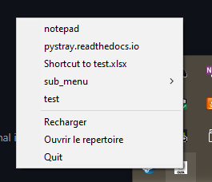

# FApp Lancher

A Applications launcher from windows systray

## Installation

Copy the exe file where you want

Or just use source code

python fapp_launcher.py

## Usage

FappLauncher [-h] [path] [title]

positional arguments:

  path        path with shortcuts or documents
  title       Title on systray

options:
  -h, --help  show this help message and exit

Default path is ./menu

#### A systray menu 

